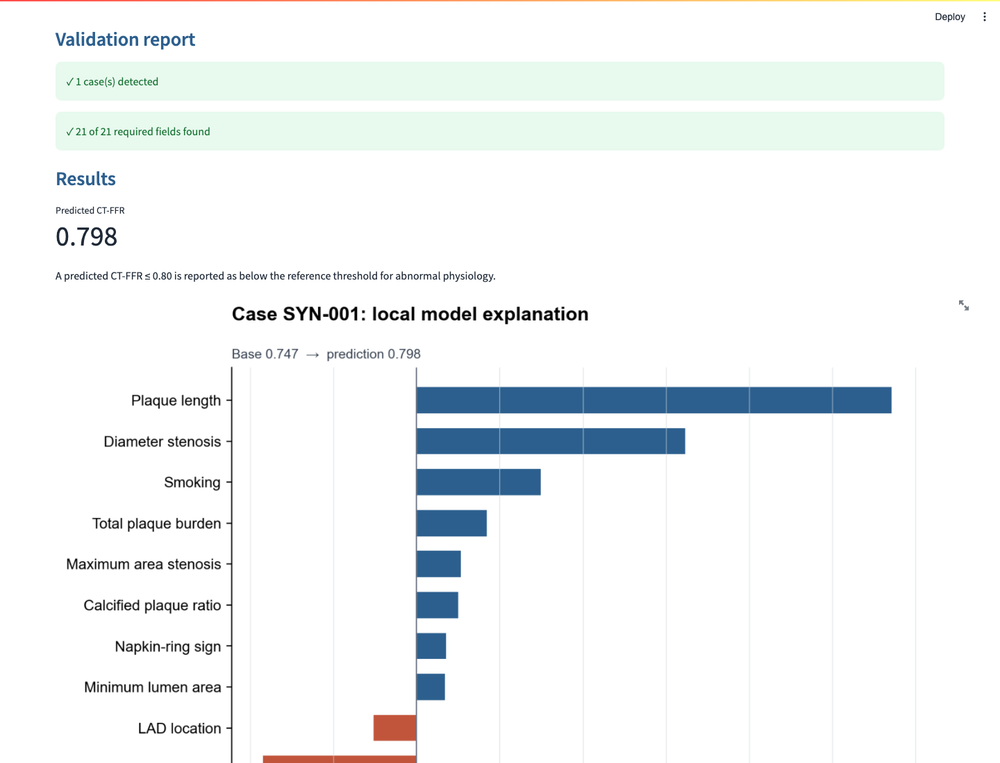
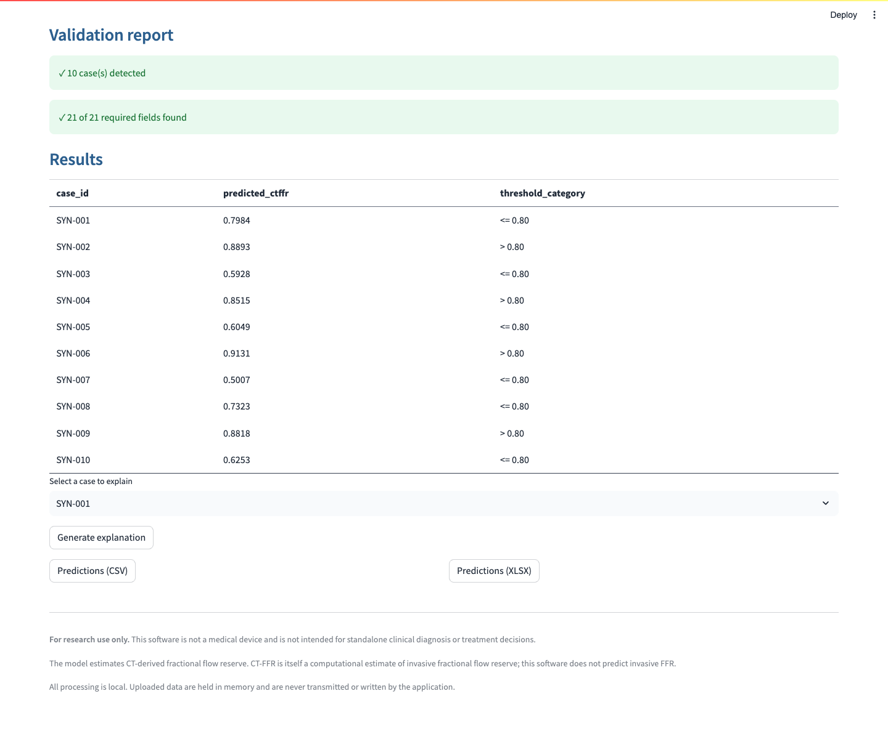

# Guided Demo

This visual walkthrough takes a new user from installation to a single-case explanation and a batch export in about three minutes.

> **Research use only.** The output is an estimate of CT-derived fractional flow reserve (CT-FFR), not invasive FFR. It must not be used as a standalone diagnosis or treatment decision.

## 1. Start the local app

```bash
python -m venv .venv
source .venv/bin/activate  # Windows: .venv\Scripts\activate
pip install -e .
streamlit run app/streamlit_app.py
```

The browser interface runs locally. The application makes no network calls, uploads no data, and does not persist uploaded rows.

## 2. Run a single synthetic case

1. Open **Getting started** and download the included synthetic sample.
2. Choose **Upload file** and select `examples/sample_case.xlsx`, or use the manual-entry form.
3. Review validation messages, then run the prediction.



The result panel contains:

- a continuous predicted CT-FFR value;
- the `0.80` reporting category, which is a convention rather than a diagnosis;
- a local SHAP chart showing which model inputs move this prediction up or down;
- CSV, PNG, and SVG downloads for the result and explanation.

The packaged example is hand-authored and synthetic. Its output demonstrates software behavior, not clinical performance.

## 3. Run a batch

1. Choose **Upload file** and select `examples/sample_batch.csv`.
2. Correct any blocking row-level errors shown by the validation report. Range warnings identify extrapolation but do not block inference.
3. Review the compact results table, download CSV/XLSX, and select one case only when an explanation is needed.



Batch mode deliberately generates SHAP graphics on demand. This keeps the results readable and avoids unnecessary computation for large files.

## 4. Understand the data flow

| Stage | What happens |
|---|---|
| Input | `case_id` plus 20 raw predictor fields are entered or uploaded. |
| Validation | Missing fields, invalid types, duplicate IDs, and unrecognized vessel text block inference; extrapolation produces a warning. |
| Derivation | The package derives BMI class, Mifflin BMR, plaque ratios, high-risk plaque count, and vessel indicators. |
| Locked inference | The integrity-checked pipeline receives 23 ordered inputs and returns continuous CT-FFR. |
| Explanation | SHAP uses 25 aggregate centroids, not row-level patient records. |
| Export | Results and explanations are available as CSV/XLSX and PNG/SVG. |

## 5. Optional command-line workflow

```bash
ctffr validate --input examples/sample_case.xlsx
ctffr predict --input examples/sample_batch.csv --output predictions.xlsx
ctffr explain --input examples/sample_case.xlsx --case-id SYN-001 --output explanation.png
```

The web app, CLI, and Python API call the same package-level inference code, so the numerical path is shared across interfaces.

## Privacy-preserving SHAP disclosure

The research analysis used 64 real development-cohort rows as its SHAP background. Those rows are not distributed. The app instead ships 25 k-means centroids, which are aggregate feature-space summaries rather than patient records. This changes the stable base value from `0.75341` to `0.74707` (difference, `-0.00635`). Local contribution differences and ranks depend on the case and permutation path, so app explanations should not be expected to reproduce manuscript SHAP charts exactly.

For field definitions and model boundaries, continue with the [data dictionary](DATA_DICTIONARY.md), [input format](INPUT_FORMAT.md), and [model documentation](MODEL.md).
